# PLC_programming

## Motivation
PLC is the core of modern industrial control.  
It's not just used in manufacturing lines but also in power plants as part of SCADA systems or even in industrial robots.  
There is a reason some of top robotics companies such as ABB, Mitsubishi, Omron are PLC manufacturers, too.  

## Advantage/Disadvantage of PLC
In summary,  
PLC has some advantages and disadvantages comparing to Arduino, a famous DIY controller, or even using a PC as a controller.  
Advantages:  
1. Industrial grade (durable, milli-second level response, higher endurance against dust, temperature and continuous use, longevity, etc)  
2. Easier maintenance  
3. Built-in debug/diagnosis  

Disadvantage:  
1. Expensive - cheaper ones cost about $$$ (without software license), usually a few thousands to tens of thousands.  
2. Entry-barrier - requires electrical knowledge  
3. Limited data processing capacity - may not be suitable to handle data for DL/ML  
4. Lack of version control

--

Using a PLC is common practice only in industrial robotics, not common in other robotics projects for several reasons.  

For example, controller for automotive or aerospace (NASA rovers) often requires higher standard than what PLC can deliver  
– micro-second response vs milli-second PLC response, heat endurance near the hot engine (some PLC’s have higher heat endurance though),  
radiation exposure from the outer space, etc. In addition, it might not be an economical choice when there is a high manufacturing volume  
like vehicle models. It’s simply much cheaper to develop a PCB from scratch.

On the other hand, robotics projects in a much less sensitive environment such as a research lab in some university,  
where only the proof of concept had to show, likely wants to do latest, advanced perception such as ML/DL rather than reliable,  
industrial grade control. However, PLC inherently has very small memory/storage size, not suitable for such advanced perception  
that requires massive data. PLC is only good for control, but a robot needs both perception and control.  
These projects are usually very budget limited, expensive PLC is likely not an option.

Another entry barrier is the PLC programming knowledge itself. There is a technological blind spot inherent to PLC.  
Learning PLC requires certain level of multi-disciplinary knowledge in both electrical circuitry and programming.  
PLC knowledge is more abundant in industrial automation (Electrical Engineering dept.) than robotics field (Computer Engineering/Science dept.).  
But at the same time, PLC is something that has developed for a few decades just like any other programming languages  
(history of PLC & ladder logic is older than C++), and it takes years of learning and experience to master it.  
This often prevents researchers to try PLC from the first place.

*<https://arstechnica\.com/science/2019/11/space\-grade\-cpus\-how\-do\-you\-send\-more\-computing\-power\-into\-space/>

## PLC Device Selection: Allen Bradley (AB) MicroLogix 1100
Good video explaning 3 popular big PLC brands around the world.
  

AB from Rockwell Automation is the most popular PLC brand in U.S. Even our team at work use AB PLC.  
This is one of the reasons I chose AB PLC even though there are cheaper models from another brand.  

There is actually cheaper AB PLC models from AB, Micro PLC's although not mentioned in the video.
The problem of Micro models is its software - CCW (Connected Components Workbench).  
It's totally different from standard PLC Logix software - RsLogix 5000 and 500 (tone down version of 5000).  

On the other hand, regular RsLogix software is very expensive for personal try, around a thousand of USD.  

Here is the download/install instruction for free RSLogix 500 Lite for MicroLogix 1100.
https://www.theautomationstore.com/rslogix-500-training-downloading-and-installing-rslogix-500-and-rslinx-for-free/

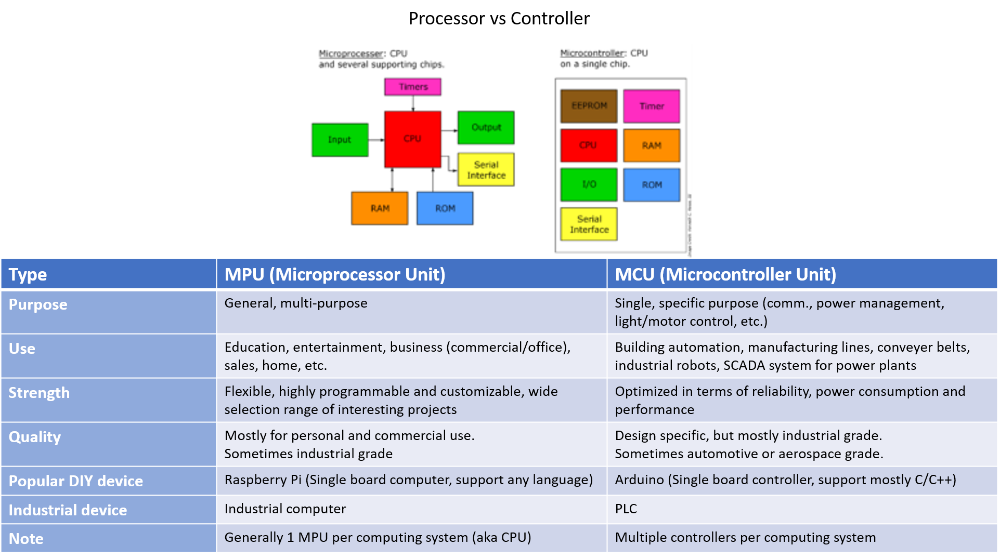\

What is Ladder Logic?

PLC software supports various programming languages.

Rockwell AB PLC software supports 4 different languages:

Ladder Diagram (LD)\, Functional Block Diagram (FBD)\, Sequential Function Chart (SFC) and Structured Text (ST).

Ladder logic is another name of LD and is most common\, widely used in PLC programming.

Following is the basic example of PLC languages.

Comparison to other programming languages

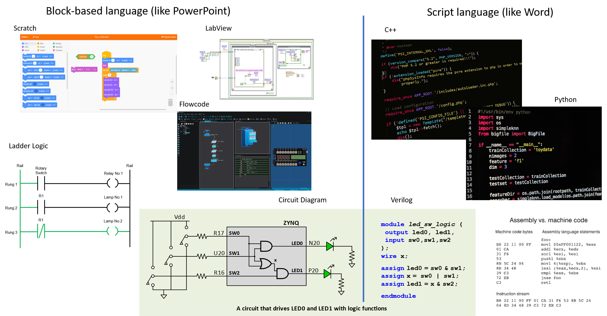

Comparison to other programming languages

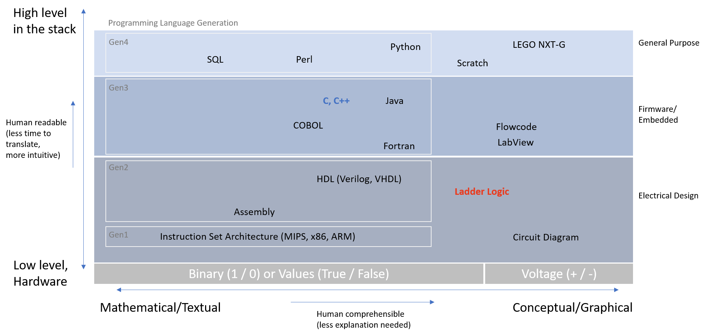

Ladder Logic Basics: Notation

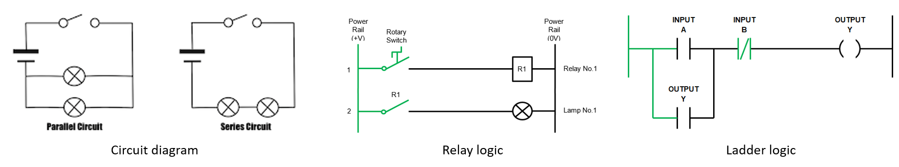

Ladder logic is derived from relay logic\, which is also derived from a circuit diagram.

One distinction of relay/ladder logic from circuit diagram is\, there is a sequence.

Just like a typical script programming language\, ladder logic is executed from **left to right\, top to bottom** .

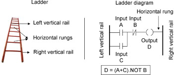

Ladder Logic Basics: Notation

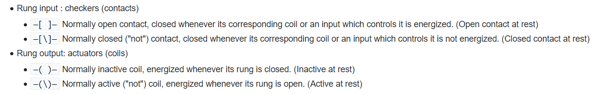

See Wikipedia for more notation basics.

<https://en\.wikipedia\.org/wiki/Ladder\_logic>

In C++\, "if A then B else C" can be expressed like this\,

A ? B : C;

In ladder logic in a PLC\,default is

"if-then-else" can be implemented as

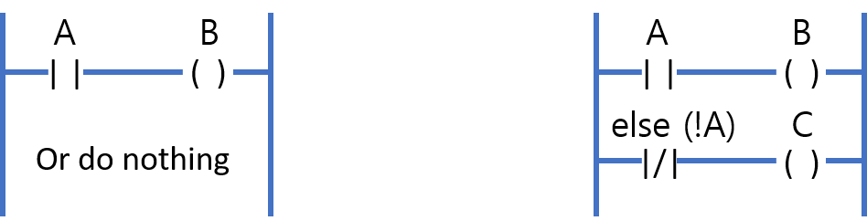

Ladder Logic Basics: Logic

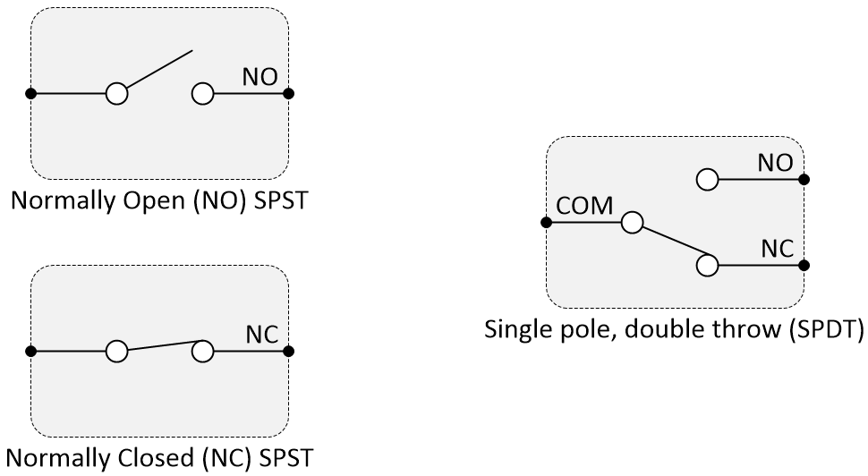

Disclaimer:

This part could be a tricky as an electrical way of thinking/knowledge required.

What's explained here may have some incorrect description as detail is slashed.

As you start to learn ladder logic and PLC\, you'll notice there are terms like following often used:

Normally closed/Normally opened\,

Activate/De-activate\,

Energize/De-energize\,

Set/Reset (or Latch/Unlatch for AB PLC)

This is because there is a **default\, usual (Normal) condition** and there is a **triggered\, unusual (seldom) condition** .

For example\, refrigerator should be always on\, therefore normally closed condition.

On the other hand\, microwave is on only temporarily while it's used\, then unlatch when timer is done.

Other applications\, that could be more subtle could be neither NO nor NC.

It's probably easier to think "Normal" and "Closed/Open" separately.

PLC control is done by energizing/de-energizing each bit (on/off) of a process.

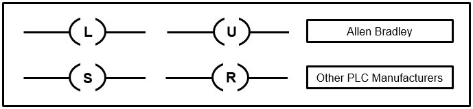

Ladder Logic Basics: Logic Status

The problem described here explains a situation that shows distinction

between the concept of NO/NC\, Activation/De-activation (from 0:32 to 1:32)

<https://youtu\.be/LhRh0BTUXiw?t=32>

As you may notice from the video and the chart on the right\, NO/NC condition is not only dependent to the subject logic itself but also whether the input switch type is NO or NC.

In general\, condition highlights green when _On/NO activated/NC de-activated/Bit energized_ in a PLC software. (Some PLC software may not support highlighting\, but AB software does)

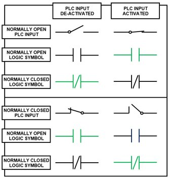

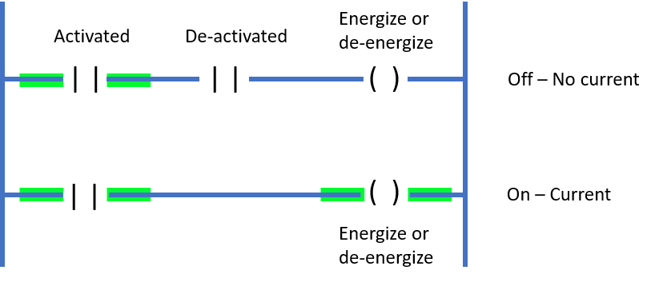

This green highlight is a convenient visualization for the true/false\, on/off status of the logic

in a near real-time when "online."

Be careful that even if a condition appears to be highlighted\, it might be flickering on and off very quickly that human eye can't catch it.

Also\, it does not guarantee the "correctness" of the logic\,

just like a build without an error does not detect the logic error.

AB PLC Software Basics (RsLogix)

Unlike script programming which is driven by programming language\, PLC is driven by software instead of ladder logic.

This means the way each software does the job\, GUI\, available instructions are different by each brand or even each software while some ladder logic basics are common. PLC software is vendor proprietary and one PLC file for one model generally does not work on another model.

For example\, file extension for

RsLogix5000 (Studio 5000) file is .acd\, while

RsLogix500 file is .rss

And other brand PLC software have different extension specific to each software. All AB PLC software runs only on Windows.

Not only these files does not compatible with another PLC software\,

studio 5000/AB PLC automatically checks for I/O and other attached peripherals that the ladder logic file created for one PLC may not work on another PLC even if the model is exactly same unless all other physical peripherals are attached in exactly same configuration.

(peripheral extensions\, order of I/O connections\, wiring\, etc.)

Because ladder logic is not a script language and PLC software is saved in such manner\, **PLC code is not version controllable** using git or mercurial due to its file structure just like any other Windows office software (.doc/.docx for Word or .ppt/.pptx for PowerPoint).

The only way to manage files is an old-fashioned way - saving major versions.

There are two other software needed to use a PLC – FactoryTalk andRsLinx.

They have several other features\, but in general\,

FactoryTalk - checks activation ofRsLogixLicense (RsLogix5000 software checks license status every time the file is opened)\, and

RsLinx- allows communication between PC and PLC.

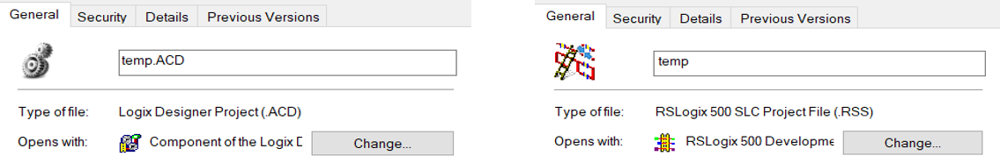

AB PLC Software Basics (RSLogix) – Link to PLC (Going online)

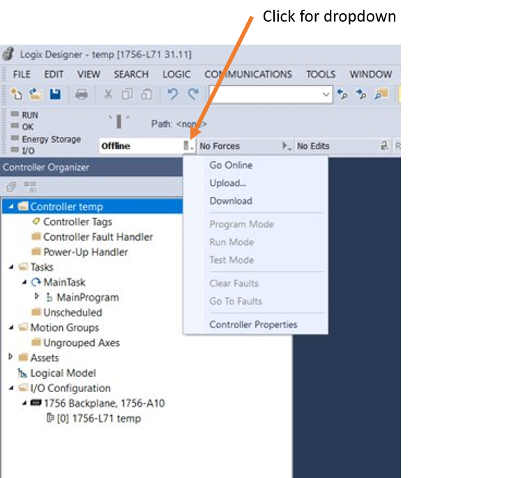

  <strong>WARNING:</strong>

The term upload/download is counter-intuitive\,

opposite from the way we understand uploading/downloading a file to/from the internet.

It may end up

wiping out the existing PLC code

 _if downloading a file to PLC instead of uploading_ \,

by replacing the code.

(Just like you may lose data stored on a storage drive when you make mistake when cloning)

Uploading/Downloading is from PLC device's perspective\, not the local PC's perspective.

  <em>UPLOAD:</em>

file stored in the PLC to your local PC

  <em>DOWNLOAD:</em>

file stored in your PC to the PLC

The PLC file stored in a PLC can be obtained by "Go online\," then "Upload" the file.

Once theRsLogixgoes "online\," the values in ladder logic displays value in real-time and status section highlights like following. When it goes "offline" from "online"\, the latest values will be snapshot captured/stored in the file.

If the code on the PLC and on the local PC are different\, a prompt will pop-up\, ask to automatically sync the code. There won't be any pop-up if both code are matching and up to date.

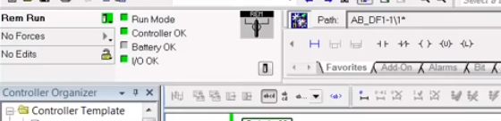

AB PLC Software Basics (RSLogix) – I/O & Data Address

In a ladder logic\, each block has address that shows what does the logic checks or converts.

In AB PLC software\, this address is in order of

[TYPE] [FILE (if applicable)] : [ROW or WORD or SLOT] [/ or .] [BIT or WORD or CHANNEL]

Each bracket [] represents one letter or number.

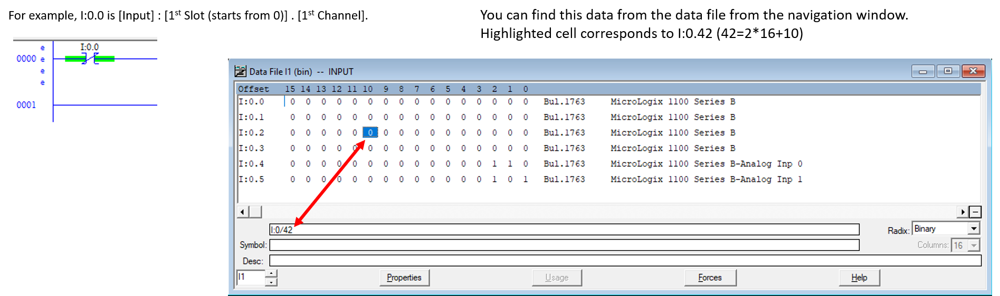

See here for list of data address rules:<http://www\.plcdev\.com/an\_introduction\_to\_rslogix5000\_tags>

AB PLC Software Basics (RSLogix) – Tag & Trend Recording

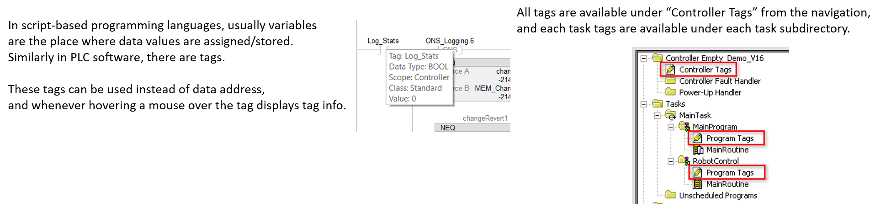

AB PLC Software Basics (RSLogix) – Instruction

Modern programming languages have sets of operators\, format conversion\, condition statements as part of their core syntax.

Instructions plays a similar role in a PLC software. Moreover\, there are not only hundreds of pre-defined sets of instructions\,

But also a new one can be defined by a user – known as AOI (Add-On Instructions).

These instructions often appear with abbreviation or even as symbols in a ladder logic.

For example\, most basic instructions are Examine if Closed (XIC) and Examine If Open (XIO).

As their name suggest\, these instructions are used for checking whether certain module is closed or opened.

See this document for the full list of instructions:

<https://literature\.rockwellautomation\.com/idc/groups/literature/documents/rm/1756\-rm003\_\-en\-p\.pdf>

Good reading about instruction detail with examples:

<https://www\.slideshare\.net/enheegejenhmandah/basics\-of\-plcprogramming1>

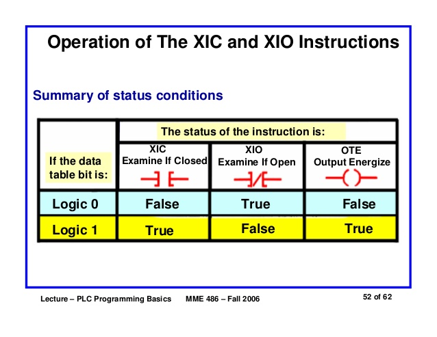

Note there is a difference between ladder logic "Open" symbol\, -| |-

\,and PLC XIO instruction\, -]/[-

AB PLC Software Basics (RSLogix) – Routine/Subroutine

So far\, basic "syntax" of PLC software is discussed.

Now\, it's probably worth to talk about PLC file itself because the meaning of PLC "file" is very different from script-based languages.

Usually software program consists of multiple files with directory structure.

Here\, files generally have .cpp/.h extensions for C++\, .pyfor Python\, etc.\, with one main function for each file.

In PLC\, Routine is what corresponds to a file that contains ladder logics.

A PLC file\, which has extension of .acdor .rssin AB PLC as discussed earlier\, is more like an entire software that includes directory structures\, configurations\, etc.

Routine/Subroutine can be useful.

With jump instruction like JSR (Jump to Sub-Routine)\, a main routine can call other routines/sub-routines.

This means main routine can contain high overview with a sequence of control processes.
